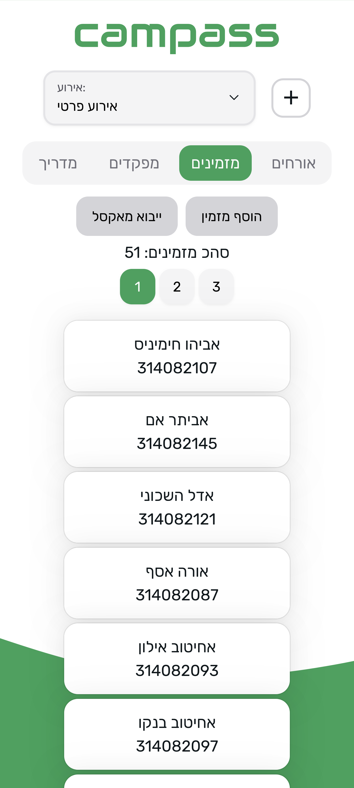

campass is a system that simplifies the process of inviting and admitting guests to various events.

Users can easily invite their guests to an event by adding them to the system, invited guests can then log in to the system to get their entry pass as a QR code which can be scanned at the event entrance to let them in.

The system enables easy and convenient guest entry via a smartphone.


# Images

<details>
  <summary>Media</summary>





</details>


# Architecture

The system is deployed using docker compose.

It has the following services:

- ngnix (For combining the frontend and backend)
- backend
- dozzle (for viewing logs)
- shynet (for analytics)


# Built With

## Backend

- Node.js
- TypeScript
- Fastify
- knex.js
- Sqlite as the database

## Frontend

- React
- TypeScript
- Axios
- NextUI as the UI library
- Zustand for state management
- Sass
- Typed scss modules for scss typing


# Getting Started

## Prerequisites

For local development you will need to install Node.js.

## Installation

Run ``npm install``  in both the backend and frontend directories.

## Environment Variables

For both the frontend and the backend copy the ``.env.example`` file to ``.env`` and fill in the required variables.

## First Run

Run ``npm run migrate`` and ``npm run seed`` in the backend directory.

## Running the app

Simply run ``npm run dev`` in both the backend and frontend directories.


# Deployment

## Initial Setup

### Environment Variables

Edit the compose file and fill in all the environment variables.

### Dozzle

Create a ``nginx/.htpasswd`` file to protect the service.
([This tool](https://hostingcanada.org/htpasswd-generator/) can be used to generate the file.)


## Running the app

Start the services using docker compose:

```bash
docker compose up -d
```

### Shynet

Create an admin user:

```bash
docker exec shynet ./manage.py registeradmin <email>
```

## Migrations

On the first run, it's necessary to run migrations to create the tables.

Execute the following command inside the container:

```bash
docker exec backend sh -c "npm run migrate"
```

Alternatively, you can pass in environment variable to the container to run the migrations on start:

RUN_MIGRATIONS=true

## Tests

Tests are written using Jest, and run automatically on every push using GitHub Actions.

To run the tests locally, simply run ``npm run test`` in the backend directory.